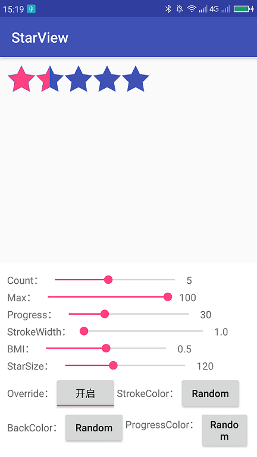

# percent-star-view

----

Demo video:

[./public/video/demo_01.mp4](./public/video/demo_01.mp4)

Preview:




build.gradle:
```groovy
repositories {
    maven {
        url  "https://dl.bintray.com/jero/android"
    }
}
```

dependencies：
```groovy
implementation "org.jetbrains.kotlin:kotlin-stdlib-jre7:$kotlin_version"
implementation "org.jetbrains.anko:anko-commons:$anko_version"
implementation 'cn.ijero.psv:percent-star-view:0.1.1'

```

XML:
```xml
<cn.ijero.psv.PercentStarView
    android:id="@+id/mainPercentStarView"
    android:layout_width="wrap_content"
    android:layout_height="wrap_content"
    android:padding="10dp"
    app:psv_isStrokeOverride="true"
    app:psv_max="100"
    app:psv_progress="15"
    app:psv_starBMI="0.5"
    app:psv_starBackColor="@color/colorPrimary"
    app:psv_starCount="5"
    app:psv_starProgressColor="@color/colorAccent"
    app:psv_starSize="50dp"
    app:psv_starStrokeColor="@color/colorPrimary"
    app:psv_starStrokeWidth="1px" />
```

JAVA:
```java
PercentStarView percentStarView = findViewById(R.id.mainPercentStarView);
percentStarView.max(200)
        .progress(120)
        .bmi(0.3F)
        .count(4)
        .starBackColor(Color.WHITE)
        .starProgressColor(Color.RED)
        .starStrokeColor(Color.parseColor("#FF666666"))
        .starSize((int) TypedValue.applyDimension(TypedValue.COMPLEX_UNIT_DIP, 40, getResources().getDisplayMetrics()))
        .strokeWidth(1)
        .strokeOverride(true);
```

kotlin:
```kotlin
mainPercentStarView.max(200)
            .progress(120)
            .bmi(0.3f)
            .count(4)
            .starBackColor(Color.WHITE)
            .starProgressColor(Color.RED)
            .starStrokeColor(Color.parseColor("#FF666666"))
            .starSize(TypedValue.applyDimension(TypedValue.COMPLEX_UNIT_DIP, 40f, resources.displayMetrics).toInt())
            .strokeWidth(1f)
            .strokeOverride(true)
```
